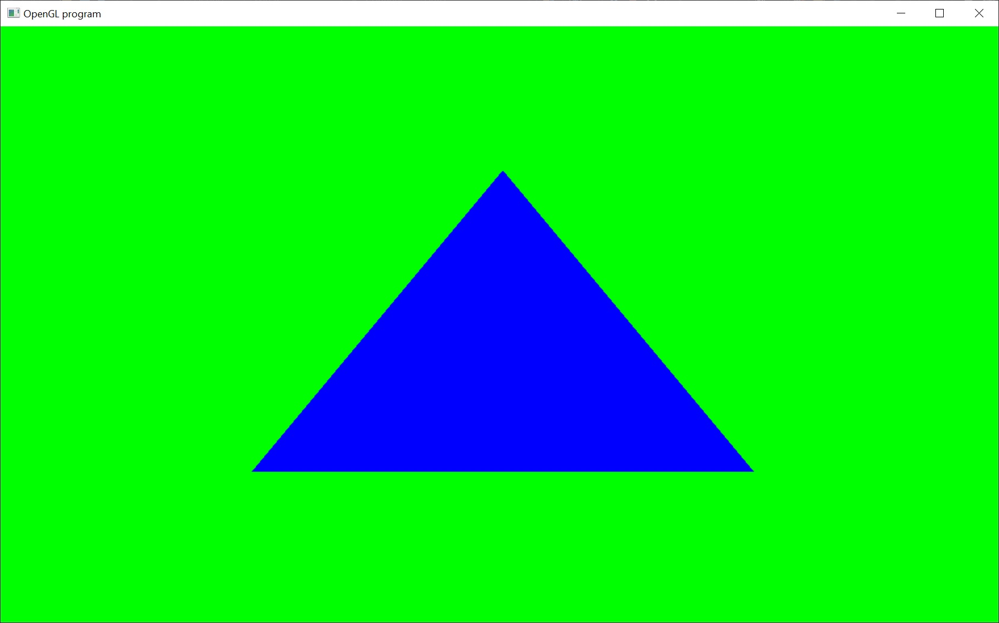

# Triangle

Okay, I was a little bored and decided to just throw out the next tutorial.  This one is very simple, as promised.  It just draws a triangle to the screen.

To make it as simple as possible.  This tutorial uses a very old school OpenGL feature that uses glBegin()/glEnd().  This is going to be deprecated in the next major revision of OpenGL and we will only use it this one time.

The important take away of this tutorial is how OpenGL treats the screen space coordinates of the window.  The lower left corner of the window is (-1,-1) and the upper right coordinate of the window is (1,1).  Now, OpenGL is inherently 3D and the z-coordinate of the window also ranges between -1 and 1.

So, the x-coordinate represents the horizontal position of a pixel in the window and ranges [-1,1].  The y-coordinate represents the vertical position of a pixel in the window and ranges [-1,1].  The z-coordinate represents the depth position of a pixel in the window and rangers [-1,1].

This range is important because OpenGL will not render anything outside of this volume of space.  The x and y range makes sense because anything outside of that range will not be inside the screen space of the window.  The z range will eventually make sense when we start to draw things in 3D using a perspective projection.

Unfortunately, there's no wikipedia page yet describing normalized device coordinates.  But this link might be useful for helping to explain it

http://stackoverflow.com/questions/15693231/normalized-device-coordinates
