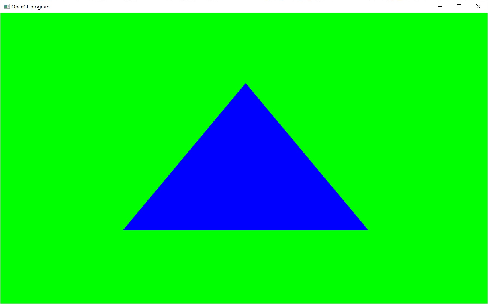

# Draw Arrays

This tutorial does the exact same thing as the previous tutorial.  It renders a blue triangle.  Only this time, instead of using the code:

// Draw a simple triangle
glBegin( GL_TRIANGLES );
glVertex3f( -0.5f, -0.5f, 0.0f );
glVertex3f( 0.5f, -0.5f, 0.0f );
glVertex3f( 0.0f, 0.5f, 0.0f );
glEnd();

Which is a very old and soon to be deprecated way of rendering triangles.  It's also not the most robust way of rendering a triangle.

So, we need to find a more robust form of rendering triangles.  OpenGL offers us this in the form of the of function glDrawArrays and glDrawElements.  In this tutorial we're going to stick with glDrawArrays, as it's slightly simpler than using glDrawElements.  However, in the future, we're going to switch to glDrawElements because it can be more memory efficient for large models.

This particular usage of these are going to use the fixed function implementation of OpenGL.  Later, we'll switch to using the programmable GPU aspect of OpenGL.  But for right now, we only need a very simply implementation, hence the fixed function.

http://en.wikipedia.org/wiki/Fixed-function

In this version we have to tell OpenGL that we want to use its fixed function pipeline.  We start this by "enabling" the vertex array:

glEnableClientState( GL_VERTEX_ARRAY );

We also need to have an actual array of vertex data:

float vertices[ 9 ] = {
	-0.5f, -0.5f, 0.0f,
	0.5f, -0.5f, 0.0f,
	0.0f, 0.5f, 0.0f
};

The above code defines a set of three points that each have an xyz coordinate.  The first vertex is set to (-0.5, -0.5, 0.0).  The second (0.5, -0.5, 0.0).  The third (0.0, 0.5, 0.0).

After having that, we need to pass this data to OpenGL.  To do this, we use the function glVertexPointer.

After passing the vertex data to OpenGL, we can finally render it.  Now, we use the function glDrawArrays.

And that's it.  It's a little more complicated than using glBegin()/glEnd().  But it is more robust and will make our lives much easier for rendering more complicated models.