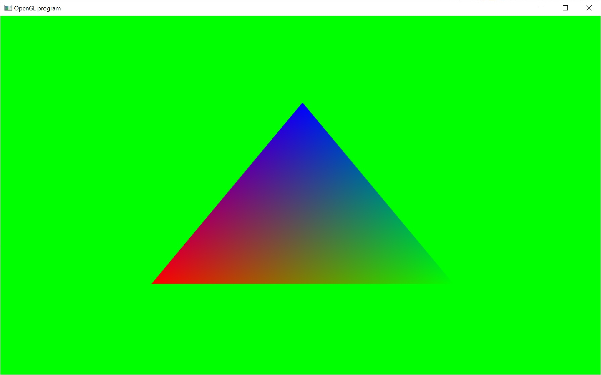

# Colored Triangle

Hey Guys,

Last time we looked at how to draw a solid color triangle on the screen using the glVertexPointer function.  This time we're going to look at how to draw a multi-colored triangle on the screen.

The real importance of this sample is to show how the GPU interpolates values between the 3 vertices of the triangle to fill in the rest of the triangle and make it appear solid.

In this sample, not only does each vertex have a position (forming the geometric shape of the triangle) but each vertex has a color.  I've set each vertex to a specific color ( one red, one green,  one blue ).  So each vertex will be that color, but the area of the triangle between the vertices will be different colors.  This is called interpolation.

Interpolation is a very simple concept.  Basically we have two points, each with specific values.  Then if we want to approximate the value between them, we can simply interpolate them.

Here's a concrete example.  Let's say we have a hill.  The bottom of the hill has a height of zero feet.  The top of the hill has a height of 20 ft.  If we measured the height of the hill halfway between the two points... we'd expect it to be 10ft (assuming the hill is a flat slope.. in this case, it's called linear interpolation).  So now, we can describe this linear interpolation with math:

h( t ) = b * t + ( 1 - t ) * a

notice that at t = 0, h = a and at t = 1, h = b
h( 0 ) = b * 0 + ( 1 - 0 ) * a = 1 * a = a
h( 1 ) = b * 1 + ( 1 - 1 ) * a = b * 1 + 0 * a = b * 1 = b

and for any points between them ( where t is a value between 0 and 1 ), h is a mix of the two:
h( 0.5 ) = b * 0.5 + 0.5 * a
h( 0.25 ) = b * 0.25 + 0.75 * a

Here's a function for doing this in code with floating point values:

float Lerp( float a, float b, float t ) {
return ( b * t + ( 1.0f - t ) * a );
}

So, this is what the GPU does to fill in the rest of the triangle.  Only it doesn't do it between just two points.  It does it between all three vertices of the triangle.  And it uses barycentric coordinates to do this. ( http://en.wikipedia.org/wiki/Barycentric_coordinate_system )

Anyway, that's enough maths.  Let's take a closer look at the new code for this sample:

// Enable the use of color arrays and ignore the globally set color
glEnableClientState( GL_COLOR_ARRAY );

// Create the color array
	float colors[ 9 ] = {
		1.0f, 0.0f, 0.0f,	// color red
		0.0f, 1.0f, 0.0f,	// color green
		0.0f, 0.0f, 1.0f,	// color blue
	};

// Pass the color array to opengl
glColorPointer( 3, GL_FLOAT, 0, colors );

That's it.  That's all the code changes that were necessary to run this sample with a multi-colored triangle.  I recommend changing the 3 different colors to other colors, just to see how that affects the rendering of the triangle.
