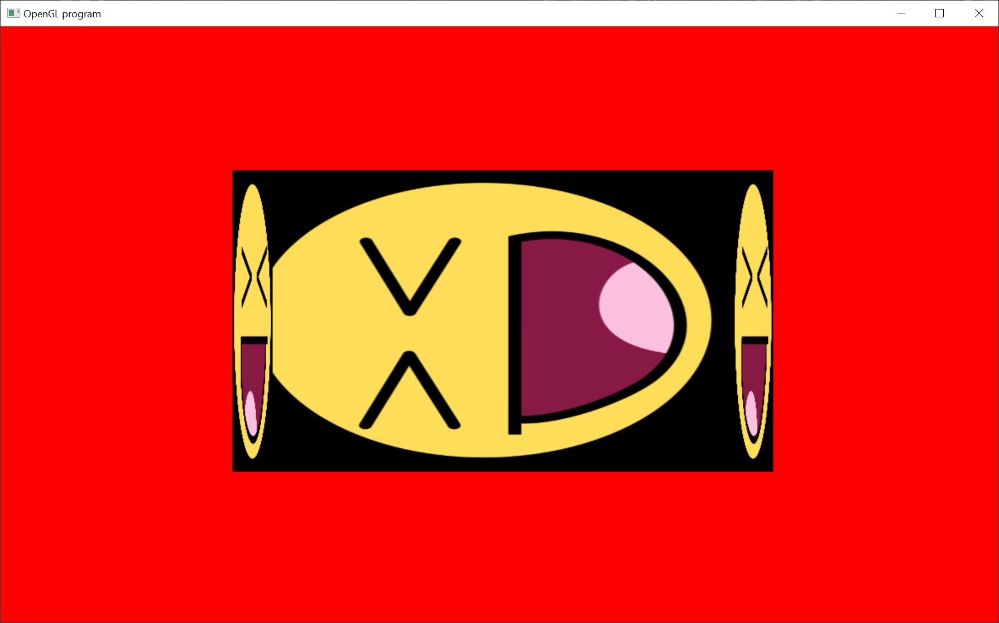

# Back Face Culling!

Okay, I know this is a lot of tutorials back to back.  But I'm a little bored this lazy Sunday.

This tutorial is almost exactly the same as the previous (codewise).  But I've replaced the simple triangle with a simple cube.

In the previous examples, it didn't matter if the triangle was facing towards the camera or facing away from the camera; the triangle always rendered.  This is a problem for more complicated models.  We don't want the triangles that are facing away from the camera to draw over the triangles that are facing towards the triangle.  This causes more complex models to appear inside out.

This can be resolved by turning on back face culling.  This will turn off the rendering of the triangles that are facing away from the camera.  There's also front face culling, and it has its use cases... but for right now we only want to cull the back faces.

To turn on back face culling we add the code:
glCullFace( GL_BACK ); // sets the cull mode to cull back faces
glEnable( GL_CULL_FACE ); // turns on face culling

In the attached sample.  The culling code is initially commented out, so that you can see what the cube looks like without any culling (it looks messed up).  Just uncomment those two lines of code to enable culling and get the cube drawing properly.  (the code is at lines 169 and 170 of winmain.cpp).