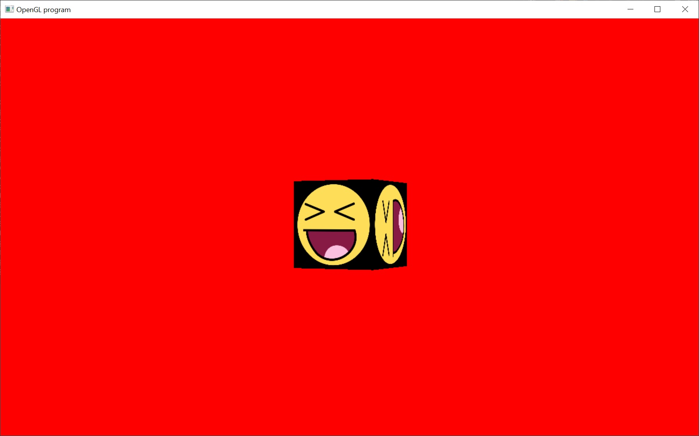

# Perspective Projection

I should slow down.  But I'm not :(

This is the best explanation I've ever seen of the perspective projection:
http://www.songho.ca/opengl/gl_projectionmatrix.html

The matrix tutorial already included all the code we needed for perspective projection.  We just didn't bother with it yet.

You'll see, in this sample, we actually set up a perspective projection matrix.  We then multiply it with the previous rotation matrix and a new translation matrix to form the final matrix that's sent to the shader.

This is how all 3D games do all of their rendering.