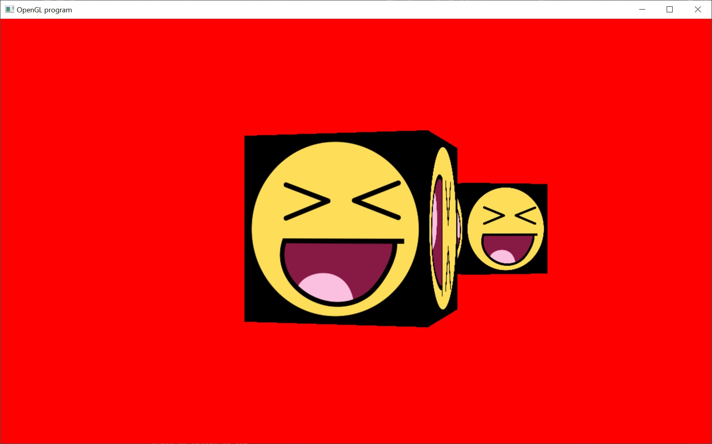

# Depth Buffer

Okay, I promise this is the last tutorial for a while.  But this one is also important.

If we have more than one model in a scene (and this will always be the case for real programs) then we have to worry about overdraw.

If we draw a model that is close to the camera, then it'll fill most of the view.  If we then draw a model further away, then it will draw over what we've previously drawn.  It'll look weird because it should draw over models that are closer to the camera.  What are we to do?

A simple solution to that problem is to use a depth buffer.  A depth buffer is similar to the color buffer.  Only instead of storing a color for each pixel on screen... it stores a depth for each pixel on screen.

When we draw a model, using a depth buffer, its distance from the camera is recorded to the depth buffer.  If we then draw a model further away (behind the first), then it compares its depth to the value stored in the depth buffer.  If its depth value is further away (greater), then it draw over the pixel.

Here's a more complete description:
http://en.wikipedia.org/wiki/Z-buffering

Now, how do we set one up in the opengl?  We have to ask for one:

// Tell GLUT to create a display with Red Green Blue (RGB) color and a depth buffer.
glutInitDisplayMode( GLUT_SINGLE | GLUT_RGB | GLUT_DEPTH );

Then we have to enable it:

// Enable writing to the depth buffer
glDepthMask( GL_TRUE );

// Set the depth test function to less than or equal
glDepthFunc( GL_LEQUAL );

// Enable testing against the depth buffer
glEnable( GL_DEPTH_TEST );

So, this sample will draw two cubes.  One is behind the other.  The one further away won't draw over the closer one.  I recommend disabling the depth buffer, just to see what it would like if the depth wasn't there.