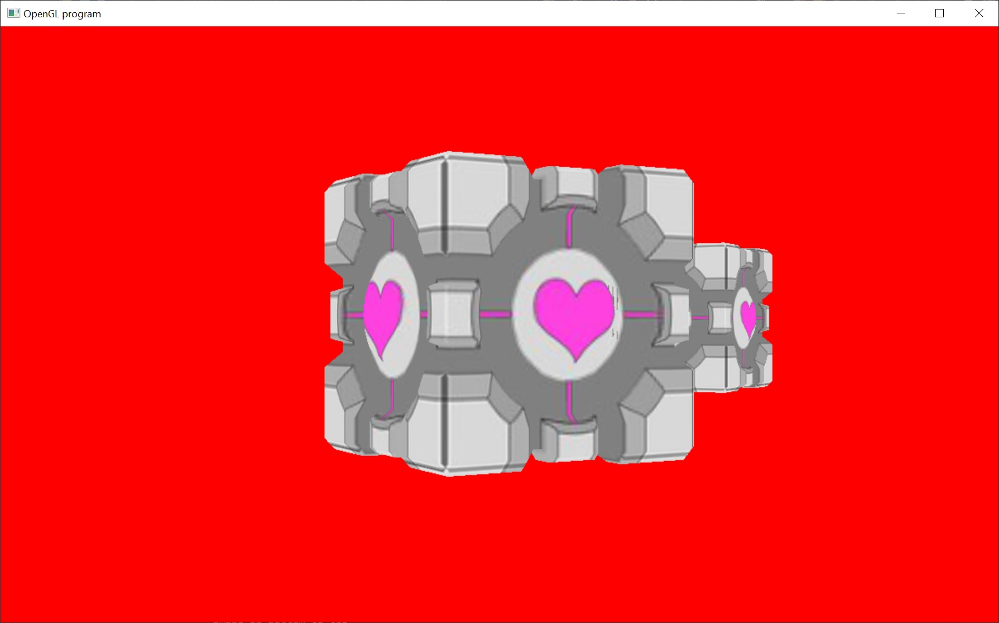

# Static Meshes

This tutorial isn't really about OpenGL.  We've been doing just fine so far with drawing a simple triangle and then a simple cube.  However, if we ever want to draw something more interesting, we need to be able to load a model that was created using an art package like 3ds max or modo or maya or blender.  So, this tutorial isn't really about OpenGL.

In this example, we'll be loading a mesh that's saved in the wavefront obj file format.  This is a very simple (and kinda old) format.  The great thing about it, is that almost everything supports it.  So, it's a very common format and popular in a lot of game engines.

Another popular format is lightwave's lwo.  However, that one's a little more complex and I wanted to keep this simple.

The obj format is a text format and therefore it's human readable.  You can simply open up the .obj files in a text editor like notepad++ to read them.

Here's a wikipedia page describing the format:
http://en.wikipedia.org/wiki/Wavefront_.obj_file

The new code for loading the mesh is located in Mesh.cpp and we'll be using this to load all of our future static meshes.  This also uses the array class from our c++ tutorials.

I've included two different obj files.  So try loading the other file to check out what it looks like compared to the other.