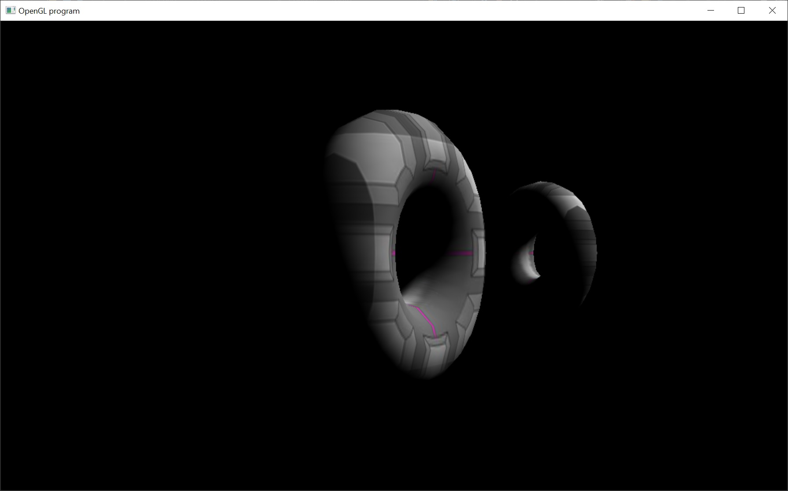

# Lighting!

This sample finally introduces lighting.  It's a very simple sample that only worries about the diffuse color.  Also note that all the real magic is going to take place in the shader code lit.vsh/fsh.

Again, here's a nice video tutorial explaining common lighting algorithms that are using computer graphics.  However, again, since this sample is only doing the diffuse... we're not going to worry about specular, ambient or emissive lighting.

https://www.youtube.com/watch?v=gFZqzVQrw84

This diffusive example is also known as Blinn shading.  This is an algorithm that is one of many different ways to perform lighting.  It's in a class of algorithms called bidirectional reflectance distribution function or BRDF ( http://en.wikipedia.org/wiki/Bidirectional_reflectance_distribution_function ).

Also, in this sample we're using a light that's infinitely far away.  This means that the light is purely parallel (similar to the light coming from the sun).

Some suggestions for modification.  Change the light direction or the light's color.
