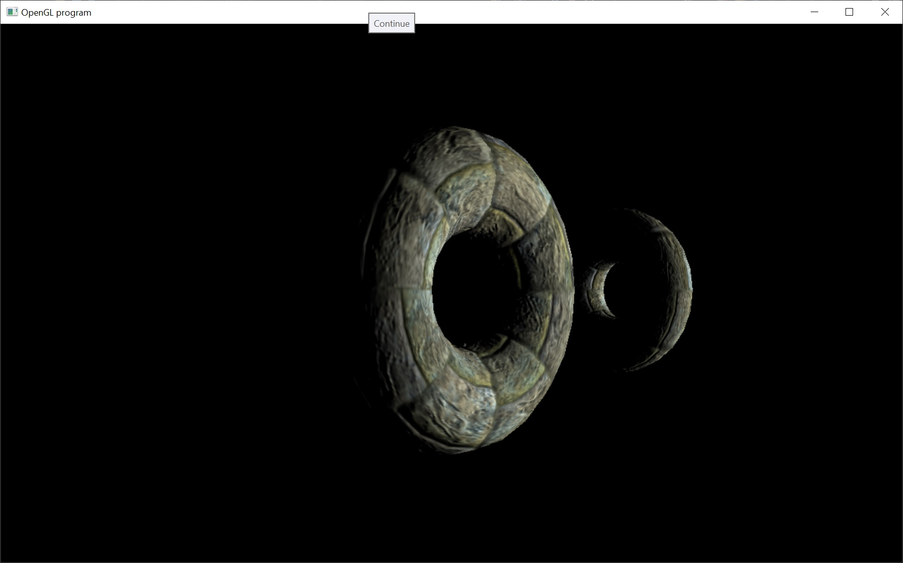

# Normal Mapping

Okay, so last time we took our first step into lighting.  And it looked pretty good.  However, the normals were only defined for each vertex.  So that makes the model look kinda flat.  What if we want a model to appear to have more geometric detail?

We have two options for that.  Either we add more geometric detail (make the model with far greater triangles), which is not possible for a real time simulation like a game or a simulator, so that's out.  We could also add another texture that stores geometric information in the texture.

Introducing normal mapping.  A normal map is another texture that stores normals.  We then look up the normal for that texel and use that normal for the lighting.

http://en.wikipedia.org/wiki/Normal_mapping

How does it work?  Well, for each vertex we calculate the tangent space.  The normals for each vertex are already stored in the obj file (or we can calculate them on load).  We then also have to calculate and store the tangent for that vertex.  I've added code for that in the Mesh::CalculateTangents function.

Then during rendering, we use the normal map and the tangent space to get a per texel normal on the triangle.  And we use that normal for the lighting calculation.  This new code is in the fragment shader program.

Checkout the normal map in the images directory.  We store the x-axis in the red channel and the y-axis in the green channel and the z-axis in the blue channel.  Notice that the normal map looks mostly blue because normals mostly point away from the surface.
Attachments area
Anti-virus warning – 1 attachment contains a virus or blocked file. Downloading this attachment is disabled.
