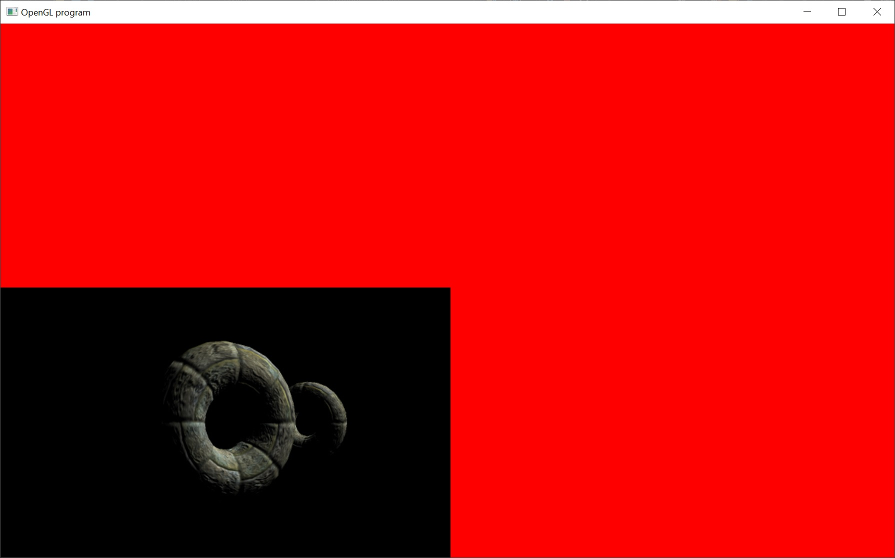

# Render to Texture

It's rather common in computer graphics to want to render something offscreen.  An example might be in a game where there's a security camera and a terminal displaying what the camera sees.  In that situation we need to render the view from the security camera to a texture, then use that texture on the terminal.

How do we render to texture?

In OpenGL there's something called a frame buffer object (FBO).  And it enables us to render to an offscreen texture.

http://en.wikipedia.org/wiki/Framebuffer_Object

I've added code in RenderSurface.h/cpp.  It contains a class called RenderSurface.  It's a pretty simple class that encapsulates the creation of an FBO.

We then bind our off screen render surface at the start of the Draw function in winmain.  And everything automagically renders to it instead.

Then, at the end of the Draw function, we bind the main frame buffer and then render the offscreen texture to the screen.

We can also use this technique to visualize the depth buffer.  And the code for that is at ln 222 of winmain.cpp