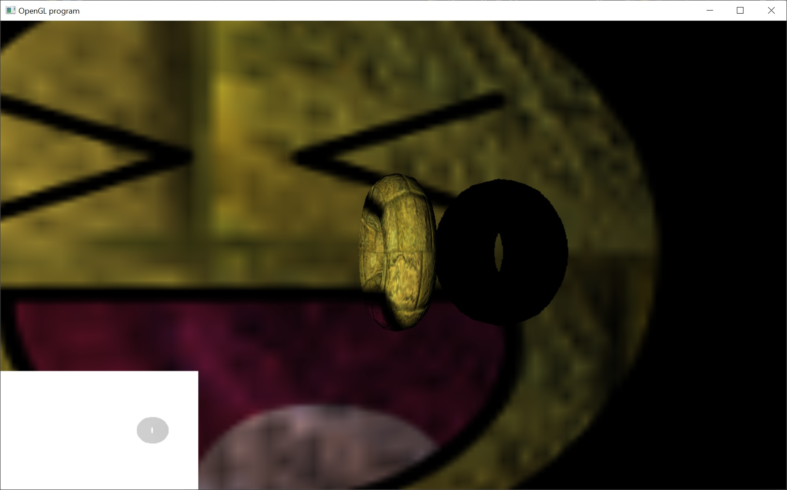

# Shadow Mapping

Alright, so our lighting started looking good with the normal mapping.  However, to really render lights properly they need to cast shadows.  There are two techniques to cast shadows in video games, shadow volumes and shadow mapping.

Shadow volumes used the stencil buffer.  The shadow geometry was rendered to the stencil buffer.  The stencil buffer was then used to prevent any lighting calculations from being performed in that region of the screen.  This technique was used in Doom 3.  Unfortunately, Creative Labs then patented the technique and now no one can use it without paying a heavy licensing fee... so no one uses this technique anymore.

The other method is shadow mapping.  This technique combines the two previous tutorials.  First we render the scene from the perspective of the light to an offscreen texture (but we only need to store the depth values).  Then, when we render the scene normally, we use projective texturing to look up the stored depth value from the light.  Then we determine if it's in shadow by comparing the depth of the fragment with the depth from the light.

The link that I sent in the last tutorial nicely explains the technique.  Pasting here again:
http://cseweb.ucsd.edu/~ravir/6160/papers/shadow_mapping.pdf

Anyway, shadow mapping is the technique that's now used by all modern games for rendering shadows.