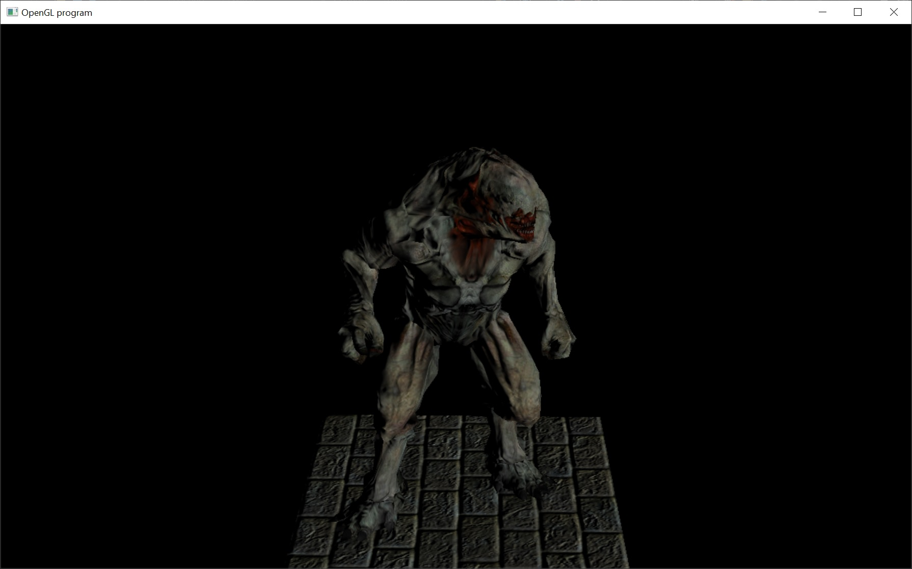

# Vertex Buffer Object (vbo)

Okay, so far, every time we draw something, we send the vertices to OpenGL by passing a pointer to the vertex data.  The only problem with this is that the vertex data has to be copied from main system memory to the gpu's onboard memory, for every single draw.  Copying lots of vertex data gets expensive and slows down our performance.  What are we to do?

We could just store the vertex data on the GPU.  That's what a vertex buffer object does.  It allocates some space on the GPU and then we only have to copy that data over once.  Then when we want to draw a mesh, we tell OpenGL to use that vertex buffer object.

This works great for our static meshes.  Unfortunately, the animated meshes are being skinned on the cpu... so we have to update its vbo every frame.

I'm also introducing the idea of a vertex array object (vao).  A vao is really just syntactic cleanliness when rendering a vbo.  It stores the binding offsets when rendering a vbo.  So, we're using them too.