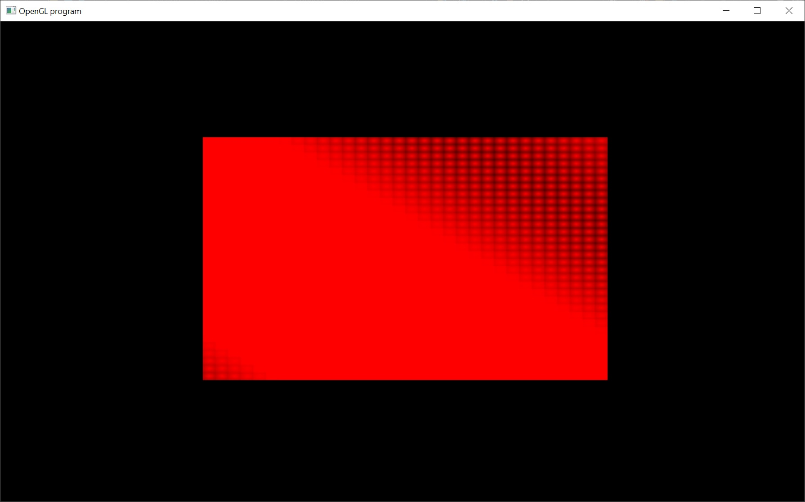

# Compute Shaders

Okay, this is the second to last tutorial in OpenGL that I have planned.  It touches upon the latest developments in OpenGL (requires OpenGL 4.3) so I'm not sure this will even run on your hardware.  If it does, then great... if not, then you've already had an excellent introduction into OpenGL.... deferred shading + skinning + shadow maps gives you everything you need to make a modernish looking game.

So what is a compute shader?  Well, as GPUs became more and more programmable, developers wanted to take advantage of this programmability.  And compute shaders is an easy way of doing this.

You can run physics simulations on a GPU using compute shader.  I've even heard of people using them to run their AI.  It can also be used for signal processing.

Now, I can't take credit for this tutorial.  I actually borrowed it from here:
http://wili.cc/blog/opengl-cs.html

However, I did integrate it into our code base by modifying the Shader class.

I also modified the Shader class to accept geometry shaders and tessellation shaders.  But we never covered those.  Those shaders do have their uses, but they come with a pretty big performance penalty, and so most people don't bother with them.  I've only ever used geometry shaders for rendering into cubemaps (for use as shadow mapping from a point light) and converting a triangle mesh into a list of voxels.  And I've only used tessellation shaders for planetary rendering.

Now, compute shaders aren't actually for rendering.  They're just general purpose compute on the GPU or GPGPU.  So, instead of running a compute shader with a call like glDrawArrays or glDrawElements... it's done with glDispatchCompute.

It's also now time to change the way we think of the GPU.  Before we thought of it as something that rasterizes triangles.  But really it's a massively multithreaded processor that runs a single program at a time on different pieces of data.  And when we call glDispatchCompute we tell it how many threads to run at a time.  We also get to decide the dimensions of it... we have three to pick.  So calling dispatch looks like:

glDispatchCompute( numThreadsX, numThreadsY, numThreadsZ )

and the total number of threads used is numThreadsX * numThreadsY * numThreadsZ.  So a call like:

glDispatchCompute( 32, 32, 1 )

uses 32 * 32 * 1 = 1024 threads.

And in this sample, we use a compute shader to fill a texture image.  Then we draw the texture image to screen.