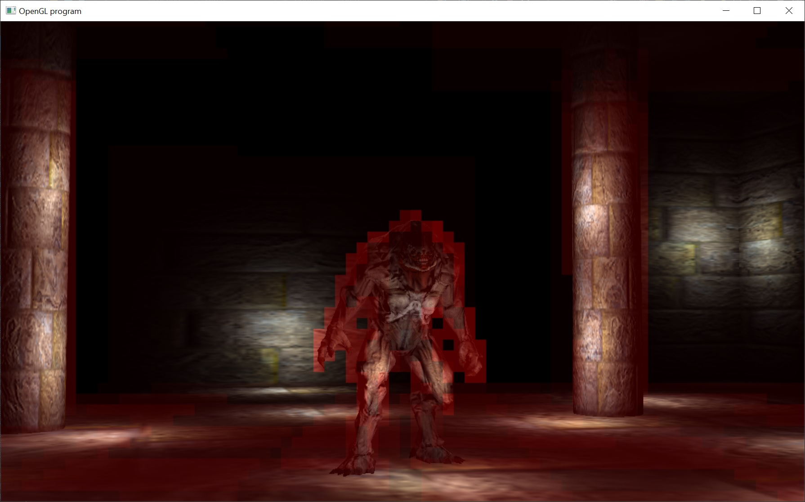

# Tiled Forward Rendering (aka Tiled Forward Lighting)

This is the last tutorial that I have planned.  And it covers the latest development in rendering.  In fact, this is how all the latest AAA games, that I know, are doing their rendering.  It also requires the latest version of OpenGL ( version 4.4 )... so if the last tutorial didn't run on your hardware... then unfortunately this one won't run either.

This came into existence with the 2012 paper titled Forward+.  There's also a slightly improved version of this called Clustered Forward Rendering (but we're going to stick with the tiled lighting for this example).

The basic idea is to go back to forward rendering, but to create a per tile buffer of lights.  Let's re-cap forward rendering.  It was the way Doom 3 (and many other games) did their lighting before deferred lighting became popular.  It's neatly outlined by Fabien Sanglard at:

http://fabiensanglard.net/doom3/renderer.php

And the rendering loop looks like:

foreach( mesh in scene ) {
   foreach( light affecting mesh ) {
      Draw( mesh with light )
   }
}

Then deferred lighting became available to commercial GPUs with the Xbox360 and PS3.  And there we created an offscreen g-buffer that we filled with diffuse, normal and position information.  And that rendering loop looked like:

foreach( mesh in scene ) {
   DrawMeshToGbuffer( mesh )
}

foreach( light in scene ) {
   Draw( light )
}

And that was more efficient than traditional forward lighting.  But it still had some downsides.  All the old anti-aliasing techniques (which we didn't cover) were no longer available for use.  We also had to create these large g-buffers that consume a lot of memory on the GPU.  And as GPUs continued to get faster and faster, memory speeds did not keep up... which leads to cache misses and inefficient use of the GPU.

Now tiled forward is here.  And tiled forward works by priming the depth buffer (which is supposed to be done in traditional forward lighting).  Then break the screen into a grid of 2D tiles.  And use the depth buffer to create a list of lights that effect each tile.  Let's call this per tile list of lights, the light buffer.  Then perform forward rendering with the light buffer.  Our rendering loop now looks like this:

// prime depth buffer
foreach( mesh in scene ) {
  PrimeDepthBuffer( mesh )
}

// use a compute shader to fill the per tile light buffer
FillLightBufferUsingCompute( all lights in scene )

// now light all the meshes
foreach( mesh in scene ) {
   Draw( mesh using lightbuffer )
}

This may not seem like it's more efficient, but all the performance tests run show that it's much more efficient and scales to a huge number of lights (thousands).

Another advantage is that it reduces our memory footprint on the GPU (no more g-buffer) and we get all of our old anti-aliasing algorithms back.

Now a note on the screenshot and code.  I left the debug rendering of the lights turned on.  The debug rendering basically draws a red square representing the number of lights in the current screen-space tile.  The redder the square, the more lights there are in that tile.  It's also really easy to toggle the debug drawing off... it's at ln 303 of winmain.cpp