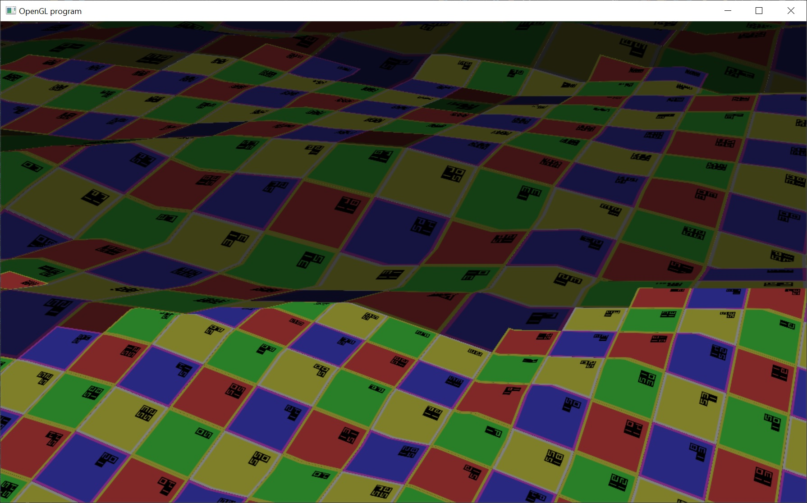

# Virtual Texturing

The implementation here is outlined in JP Van Waveren's white paper, "Software Virtual Textures".  The paper can be found on his website: https://mrelusive.com/publications/papers/Software-Virtual-Textures.pdf

This is only half of a proper virtual texturing implementation.  It does not stream texture pages from file, transcoding them from a compressed format on disk to a block compressed format on the gpu.  Instead this only displays cpu generated debug texture pages.

The basic idea behind virtual texturing is that you have one giant texture.  In this case a 128k x 128k texture.  This is obviously too large to fit into memory.  So, instead we only load the portions of the texture that are needed for rendering.

In order to do this, we break the virtual texture into 128 x 128 pages.  Giving us a total of 1024 x 1024 pages.

The pages that are needed for rendering are copied into a physical texture (4k x 4k texels) that is resident on the gpu.  The physical texture acts as a cache for loaded pages.

To map from the virtual texture to the physical texture, we need a page table (aka indirection table).  The page table is a 1024 x 1024 mip mapped texture that maps the page in the virtual texture to its location in the physical texture.

At the start of each frame, we render the scene into a feedback buffer.  The shader used for rendering packs the page id's, visible this frame, into the feedback buffer.  We then read back the buffer on the cpu.  This lets us know which pages are necessary for rendering the scene that frame.

If a page visible this frame is already resident in the physical texture, then nothing is done.  When a page is not already resident, it is uploaded to the physical texture and the page table is updated with the appropriate mapping.  If the physical texture is full (there is no space for new pages), then a most recently used (MRU) heuristic is used to eject stale pages.

