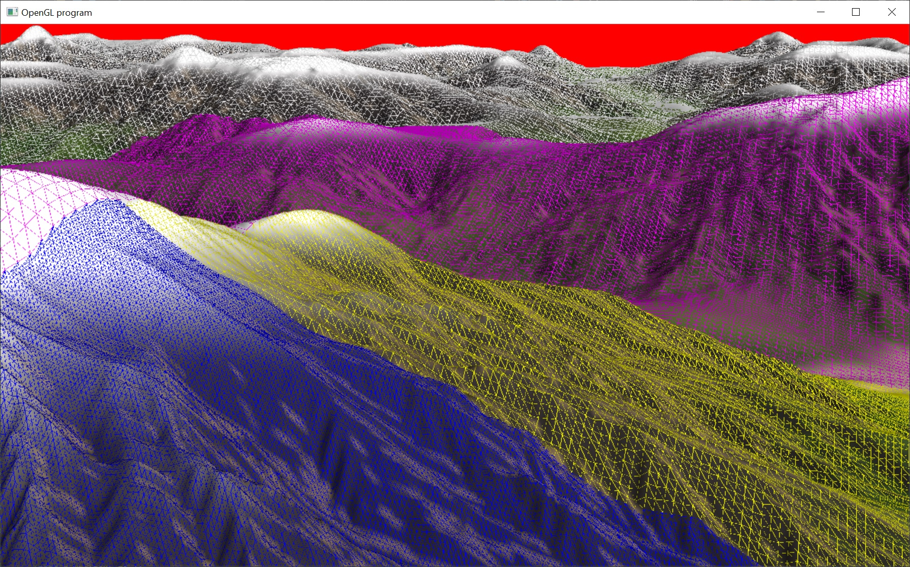

# Terrain

This is a basic implementation of the terrain heightmap that is used by Far Cry 5.

It is not a full implementation as it does not include streaming from disk, it is only performed on the CPU, and it is not textured.

The height map is generated using Fractal Brownian Motion.
https://thebookofshaders.com/13/
https://iquilezles.org/articles/morenoise/
https://iquilezles.org/articles/warp/

This height map is adopted from shader toy code
"Terrain Erosion Noise" by Fewes
https://www.shadertoy.com/view/7ljcRW

