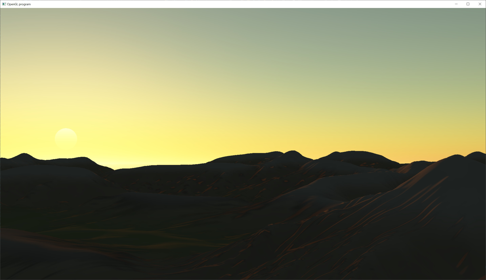

# Bruneton Atmosphere

This adds precomputed atmospheric scattering to the terrain rendering.  This is based on Bruneton's 2008 paper "Precomputed Atmospheric Scattering".

Atmospheric scattering is computed and stored in multiple textures.  During runtime, the textures are used as look up tables to determine the appropriate lighting.