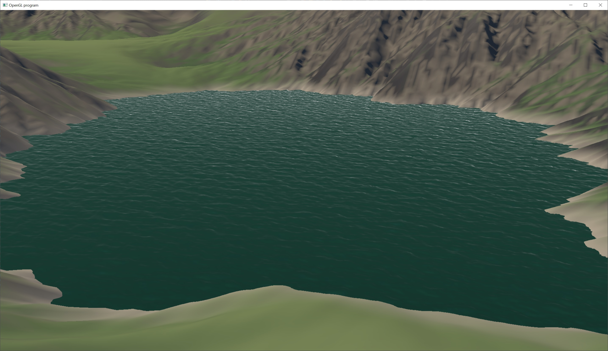

# Tessendorf Ocean Water

This is an implementation of Tessendorf ocean water.  It is based upon the paper Simulating Ocean Water by Jerry Tessendorf.

Back in the 1960's a physicist named Owen Phillips developed a theory for surface waves in the deep ocean caused by wind.  He used aerial photography of the ocean's surface and an FFT to develop an equation that describes the wave spectrum from wind and gravity.  This is known as the Phillips spectrum.

The idea for simulating ocean water in Tessendorf's paper is to calculate the Phillips spectrum and run an FFT to calculate the height map of the ocean's surface.  By updating the spectrum each frame and running the FFT on the gpu, you can render the water surface in real-time.

The actual rendering of the water surface is done using a screen space grid that is projected onto the water's plane, then displaced by sampling the water's height map.  This makes the rendering of the water O(1) and gives a natural level of detail for rendering an infinite ocean.

For an in-depth discussion on the fast fourier transform, I have a blogpost here: https://ghodges413.github.io/blogposts/maths/fouriertldr.html