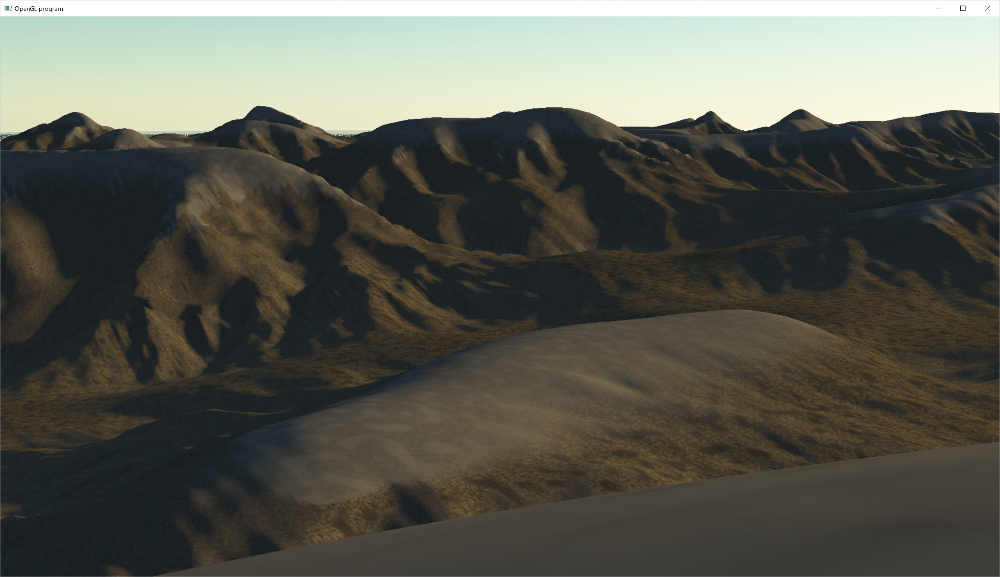

# Megatextured Terrain

This is a 10km x 10km terrain that is properly textured using virtual texturing.

The virtual texture is generated on demand using tile textures.

The texture tiles are creative commons and can be found by their creator here: https://3dtextures.me/

The height map is generated using Fractal Brownian Motion.
https://thebookofshaders.com/13/
https://iquilezles.org/articles/morenoise/
https://iquilezles.org/articles/warp/

This height map is adopted from shader toy code
"Terrain Erosion Noise" by Fewes
https://www.shadertoy.com/view/7ljcRW

