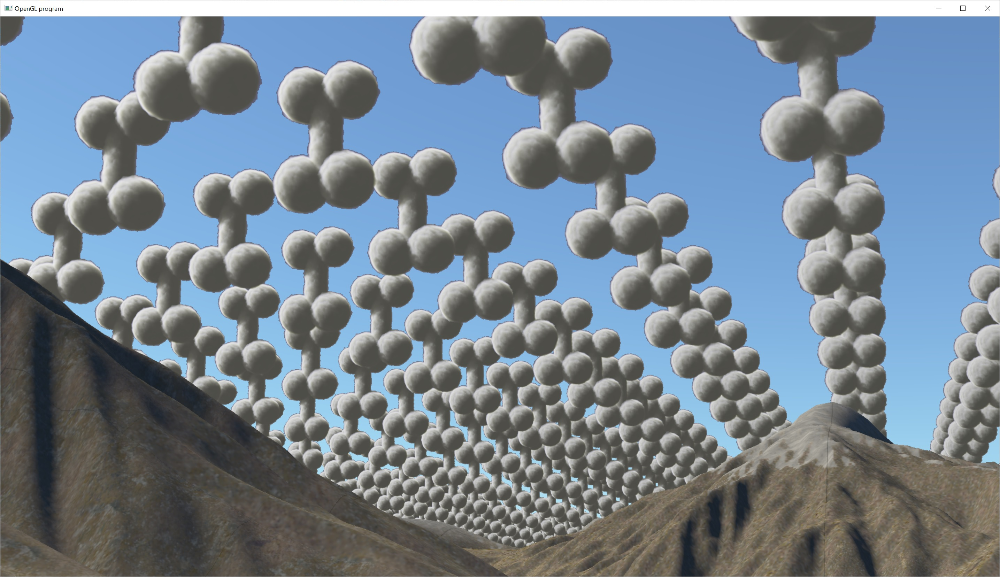

# Signed Distance Field Clouds

Blog post on animating noise for temporal integration
https://blog.demofox.org/2017/10/31/animating-noise-for-integration-over-time/

Valuable resources:
https://magnuswrenninge.com/wp-content/uploads/2010/03/Wrenninge-OzTheGreatAndVolumetric.pdf
"Real-Time Volumetric Cloudscapes" by Andrew Schneider (GPU Pro 7 chapter on Horizon Zero Dawn clouds)

Worley noise generator by Sebastien Hillaire
https://github.com/sebh/TileableVolumeNoise/tree/master

https://andrewschneider.artstation.com/projects/RnB8Dy	// links to gdc video and pdf notes

https://github.com/AmanSachan1/Meteoros	// github example of Horizon new dawn clouds

https://www.guerrilla-games.com/read/nubis-realtime-volumetric-cloudscapes-in-a-nutshell

https://www.youtube.com/watch?v=Qj_tK_mdRcA	// Simon_dev clouds
https://codesandbox.io/s/simondev-youtube-clouds-rn9kfx // Simon dev clouds sample code in browser

https://www.youtube.com/watch?v=4QOcCGI6xOU&pp=ygURbnViaXMgdm94ZWwgY2xvdWQ%3D // Coding Adventure clouds

https://www.youtube.com/watch?v=9-HTvoBi0Iw // Siggraph RDR2 cloud presentation

https://advances.realtimerendering.com/s2023/index.html // Links to advances in real time rendering presentation

https://blog.selfshadow.com/publications/s2016-shading-course/ // Siggraph on Frostbite clouds

Stack exchange discussion on tileable perlin noise generator
https://gamedev.stackexchange.com/questions/23625/how-do-you-generate-tileable-perlin-noise

