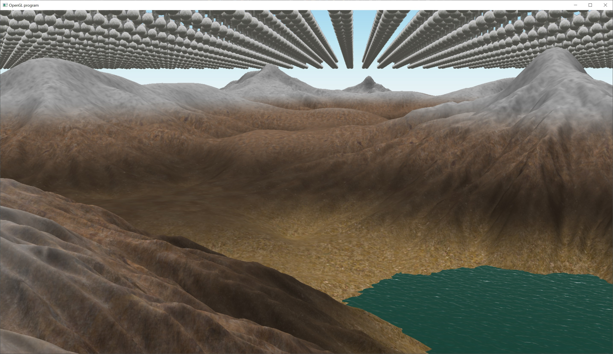

# Triplanar Texturing

https://gamedevelopment.tutsplus.com/use-tri-planar-texture-mapping-for-better-terrain--gamedev-13821a

https://bgolus.medium.com/normal-mapping-for-a-triplanar-shader-10bf39dca05a

// Splatting, methods for blending between two different textures in a terrain:

https://gamedev.net/tutorials/_/technical/graphics-programming-and-theory/advanced-terrain-texture-splatting-r3287/

// Texture bombing.  A method for eliminating patterns in tiled textures:

https://developer.nvidia.com/gpugems/gpugems/part-iii-materials/chapter-20-texture-bombing

https://developer.nvidia.com/gpugems/gpugems/part-iii-materials

https://www.shadertoy.com/view/WsjXDh

https://iquilezles.org/articles/texturerepetition

Procedural Stochastic Textures by Tiling and Blending (Thomas Deliot and Eric Heitz)
https://eheitzresearch.wordpress.com/738-2/