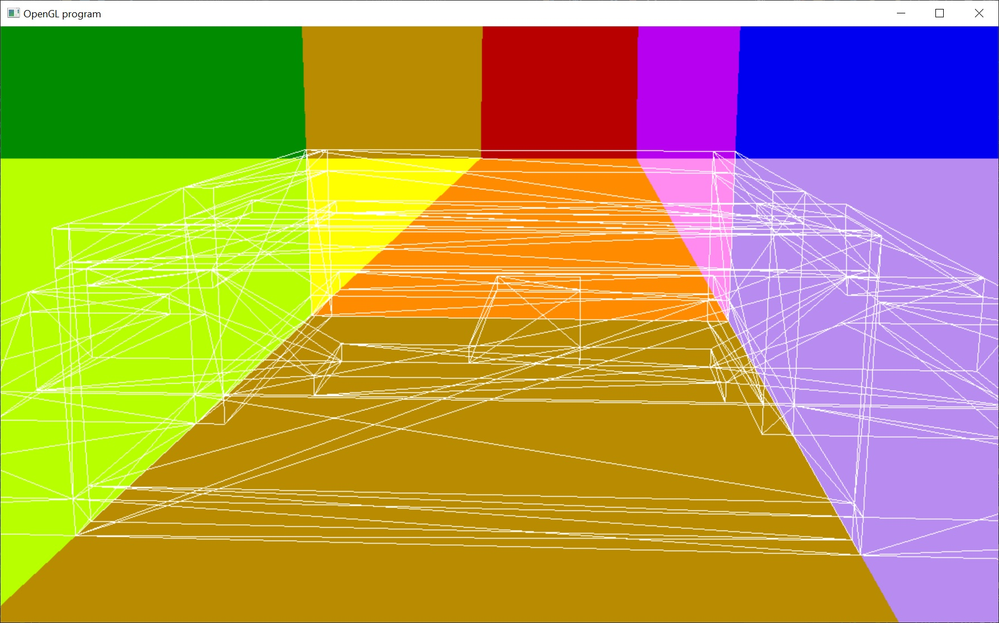

# Binary Space Partitioning Tree

This sample loads the brushes of a map built for the original Quake.  It then creates a BSP tree to store and render the windings.

BSP trees can be used to correctly render a scene using the painter's algorithm.  This is convenient for when depth buffers aren't available.  And when coupled with a potentially visible set (PVS), can be used to drastically reduce overdraw.

These algorithms are well described in "Michael Abrash's Graphics Programming Black Book"

https://quakewiki.org/

