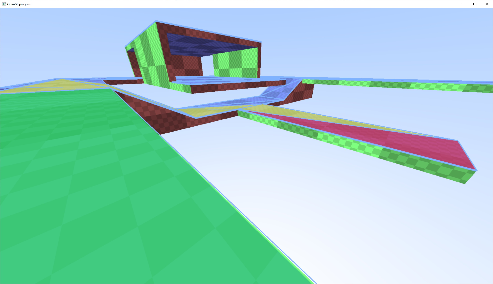
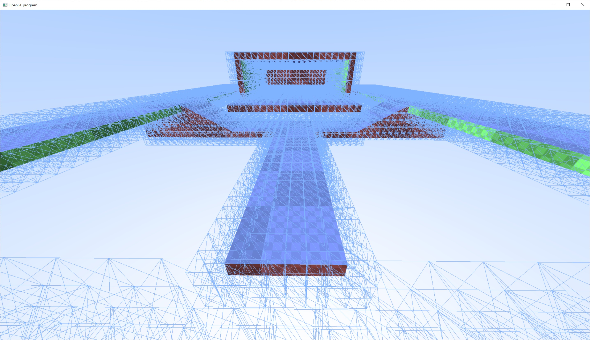
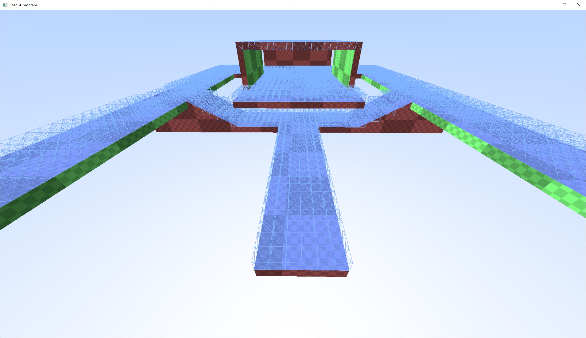
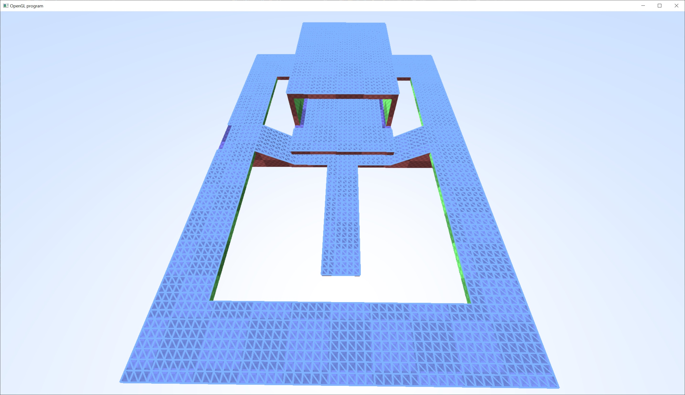
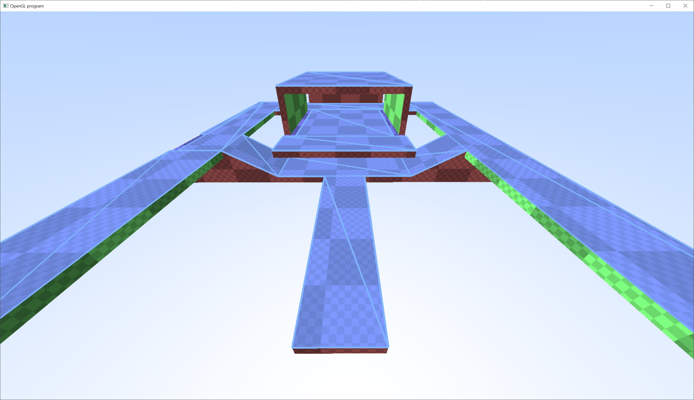

# NavMesh

This sample builds a navigation mesh (navmesh) from the brushes in the testmap.

The first step is to voxelize the geometry of the entire map.  This can be achieved through rasterization of the render geometry or intersection tests with the brushes.

The second step is to throw away any voxels that are invalid for AI/NPC to traverse.

A grid is then created by projecting the remaining voxels onto the geometry below.

The grids are then consolidated by merging adjacent grid cells.

After the cells are merged, they're converted into a graph with an adjacency matrix.  The graph is then used for pathfinding via the A* algorithm, which is shown in the top screenshot.

