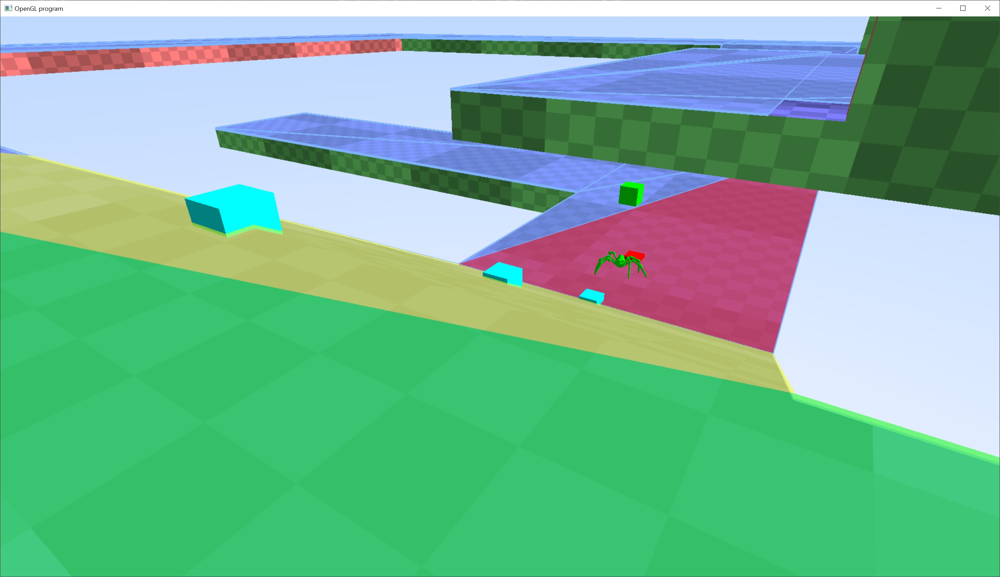

# Behavior Trees

This sample uses a behavior tree to control the decision making for an NPC that runs around the map.

A lot of behavior trees are visually scripted.  However, creating a visual scripting language is beyond the scope of this sample.  So the entire tree is implemented in code only.

Here are some resources to help explain behavior trees:

https://en.wikipedia.org/wiki/Behavior_tree_(artificial_intelligence,_robotics_and_control)

https://robohub.org/introduction-to-behavior-trees/

https://www.gamedeveloper.com/programming/behavior-trees-for-ai-how-they-work

"Behavior Trees in Robots and AI" by Michele Coledanchise and Petter Ogren (https://btirai.github.io/)