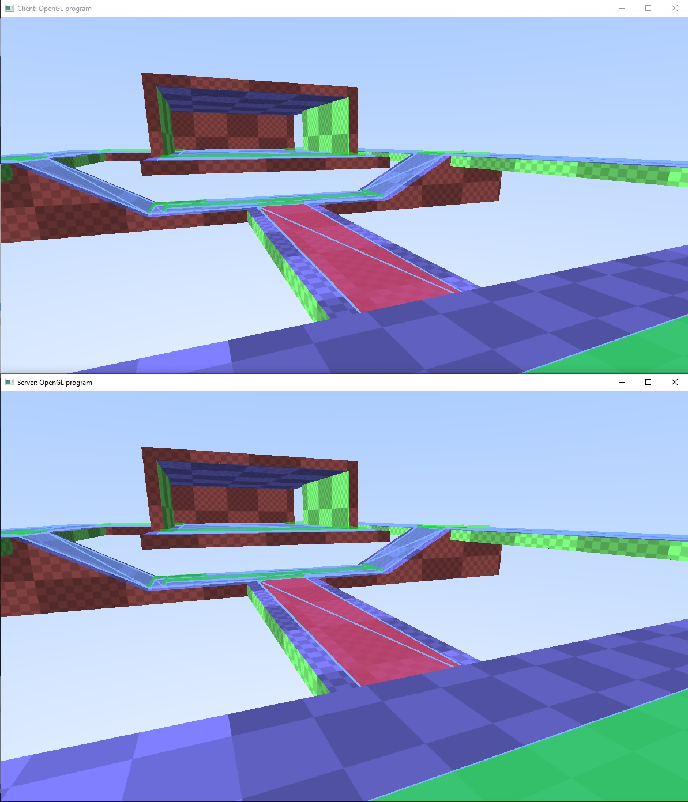

# Networking

This sample is a very basic networking sample.  The client send the server the view/position of the player.  The server will use this information to draw the world from the player's perspective.

There are two defines that are important for this sample:
USER_CLIENT
USE_UDP

The USER_CLIENT is used to compile a client vs server version of the executable.  And USE_UDP is for compiling UDP vs TCP.

This sample does not go into delta compression, prediction, or encryption.  All of which would be used in a real game's networking solution.

Resources on network programming for games:

https://fabiensanglard.net/quake3/network.php

https://gafferongames.com/post/state_synchronization/