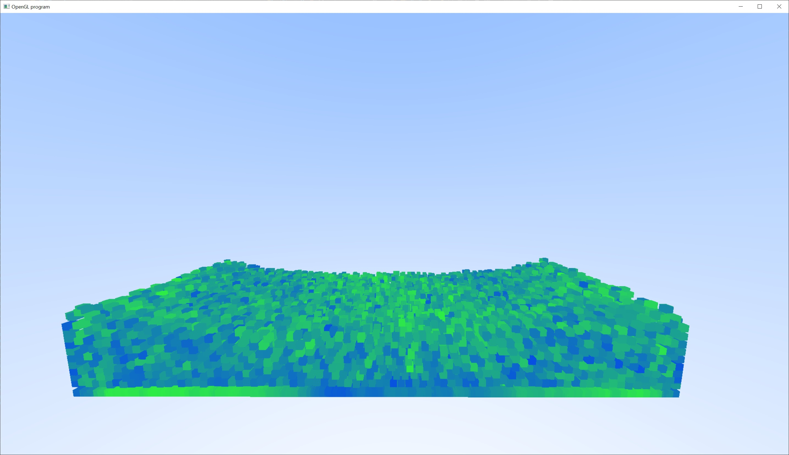

# Fluids

This sample implements a fluid simulation.

## Maths

First some basic maths.

### Gradient

Given a scalar field defined by a function, $f( x, y, z )$, the gradient is a vector field defined by:

$$\nabla f = \frac{ \partial f }{ \partial x } \hat x + \frac{ \partial f }{ \partial y } \hat y + \frac{ \partial f }{ \partial z } \hat z $$

This describes the slope of the function and the direction of the change.

### Divergence

Given a vector field $F = ( F_x, F_y, F_z )$, the divergence is defined as:

$$\nabla \cdot F = \frac{ \partial F_x }{ \partial x } + \frac{ \partial F_y }{ \partial y } + \frac{ \partial F_z }{ \partial z }$$

You can think of this as how much the vector field spreads out or compresses.

### Curl

And the curl is given by:

$$\nabla \times F = \left( \frac{ \partial F_z }{ \partial y } - \frac{ \partial F_y }{ \partial z } \right) \hat x + \left( \frac{ \partial F_x }{ \partial z } - \frac{ \partial F_z }{ \partial x } \right) \hat y + \left( \frac{ \partial F_y }{ \partial x } - \frac{ \partial F_x }{ \partial y } \right) \hat z $$

This can be thought of how much the field rotates or swirls around.

### Laplacian

And finally the Laplacian of a scalar field is the divergence of the gradient:

$$\nabla \cdot \nabla f = \nabla^2 f = \frac{ \partial^2 f }{ \partial x^2 } + \frac{ \partial^2 f }{ \partial y^2 } + \frac{ \partial^2 f }{ \partial z^2 }$$

Which describes how "lumpy" the function is.  Basically, if the function describes a heightfield, then the Laplacian tells us where the peaks and vallies are located.

## Physics

Now for some physics.

### Gravity

As we all know $F = ma$ and the force of gravity is $F_g = mg$.  Therefore the acceleration due to gravity is:

$$a_g = g$$

### Pressure

Next up is pressure.  Pressure is force per unit area.  However, if the pressure is uniform, then it won't push a volume element.  But if there's a pressure gradient, then it will be able to push a volume element.

So, given a volume element (a cube) with side length $l$, and a pressure gradient in the x-direction, $\Delta p = p_{x_1} - p_{x_0}$, then force in the x-direction will be given by:

$$F_x = ma_x = l^3 \cdot \rho \cdot a = -\Delta p \cdot A = -\Delta p \cdot l^2 $$

This means that the acceleration in the x-direction is:

$$a_x = \frac{ -\Delta p }{ \rho l } = -\frac{ \partial p }{ \partial x } \frac{ 1 }{ \rho }$$

Which means the general acceleration for pressure will be:

$$a_p = -\frac{ \nabla p }{ \rho }$$

### Viscosity

Viscosity can be modeled as "blurring" the velocity field of a fluid.  Therefore the change in the velocity field can be written as:

$$v' = v + \Delta t \mu \nabla^2v$$

$v'$ is the new velocity, $v$ is the old velocity, $\Delta t$ is the change in time, and $\mu$ is a positive scaling factor.  Re-arranging the equation a little, we can get the acceleration:

$$a = \frac{ v' - v }{ \Delta t } = \mu \nabla^2v$$

### Density Constraint

If we are to simulate an incompressible fluid, then the density must remain constant $\rho = \rho_c$.  Which means the divergence must be zero.

$$\nabla \cdot v = 0$$

### Navier-Stokes

Combining all these equations gives us the Navier-Stokes equations for incompressible flows.

$$a = g - \frac{ \nabla p }{ \rho } + \mu \nabla^2 v$$
$$\nabla \cdot v = 0$$

## Lagrangian Framework

The Lagrangian framework is a simulation that represents fluid as a set of particles.

### Smoothed Particle Hydrodynamics

Smoothed Particle Hydrodynamics (SPH) was originally developed by astrophysicists.  The "smooth" terminology is because the particle is defined to be "fuzzy".

All Kernels are required to evaluate to 1 when integrated over all of space:

$$\int W(r) = 1$$

#### Gaussian Kernel

$$
W_{std}(r)=\frac{315}{64\pi h^3}
\begin{cases}
(1-\frac{ r^2 }{ h^2 })^3 & \quad \text{when $0\leq r \leq h$}\\ 
0 & \quad \text{otherwise}
\end{cases}
$$

While the Gaussian kernel is perfectly suitable in a spatial sense, its first and second derivatives oscillate.  The oscillation of the derivatives can create unintentional attractive forces between particles.  We would like to avoid this, and a different kernel has been developed to handle this problem.

#### Spikey Kernel

$$
W_{spikey}(r)=\frac{15}{\pi h^3}
\begin{cases}
(1-\frac{ r }{ h })^3 & \quad \text{when $0\leq r \leq h$}\\ 
0 & \quad \text{otherwise}
\end{cases}
$$

The derivatives of the spikey kernel do not oscillate and lead to only repulsive forces.

#### Interpolation

Now that we have a kernel that can define a particle.  We need to be able to interpolate between particles:

$$\phi( x ) = m \sum_j \frac{ \phi_j }{ \rho_j } W( x - x_j )$$

Where $\phi$ is the quantity that we want to interpolate.  All the other values should be self explanatory.

#### Density

Density can be described with the following equation:

$$\rho( x ) = m \sum_j W( x - x_j )$$

#### Gradient

$$\nabla \phi( x ) = m \sum_j \frac{ \phi_j }{ \rho_j } \nabla W( \vert x - x_j \vert )$$

However, this version of the gradient can be asymetric.  So two particles may calculate different values.  Which will cause different forces opposing forces.  So, an alternate gradient can be defined as:

$$\nabla \phi( x ) = \rho_i m \sum_j ( \frac{ \phi_i }{ \rho_i^2 } + \frac{ \phi_j }{ \rho_j^2 } ) \nabla W( \vert x - x_j \vert )$$

#### Laplacian

$$\nabla^2 \phi( x ) = m \sum_j ( \frac{ \phi_j - \phi_i }{ \rho_j } ) \nabla^2 W( x - x_j )$$

#### Solver

The basic solver is to:

- Calculate the densities
- Calculate pressure from density
- Calculate pressure gradient force
- Calculate viscosity force
- Calculate gravity
- Step time

#### Pressure

$$p = \frac{ \kappa }{ \gamma } ( \frac{ \rho }{ \rho_0 } - 1 )^{\gamma}$$

$$\kappa = \rho_0 \frac{ c_s }{ \gamma }$$

Here, $c_s$ is the speed of sound (a constant in our simulation), and $\gamma$ is a tuning parameter.

#### Pressure Gradient

$$f_p = -m^2 \sum_j ( \frac{ p_i }{ \rho_i^2 } + \frac{ p_j }{ \rho_j^2 } ) \nabla W( x - x_j )$$

#### Viscosity

$$f_v = -m \sum_j ( \frac{ u_j - u_i }{ \rho_j } ) \nabla^2 W( x - x_j )$$

#### Collision

As for handling collision with external geometry, the collision can be resolved using the projection method.  The velocity normal to the surface is negated and reduced by the coefficient of restitution, and the tangential velocity is scaled by the friction.

## Eulerian Framework

The Eulerian framework is a simulation that represents fuild with a grid.
